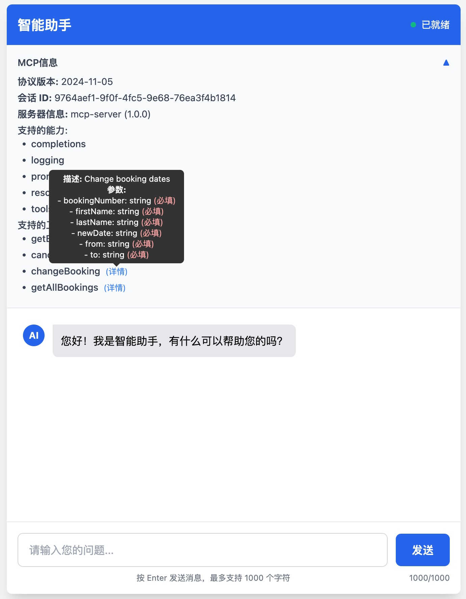
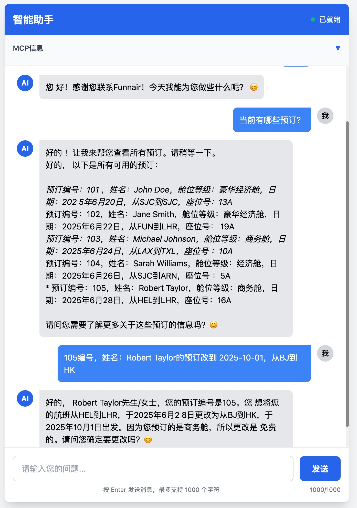
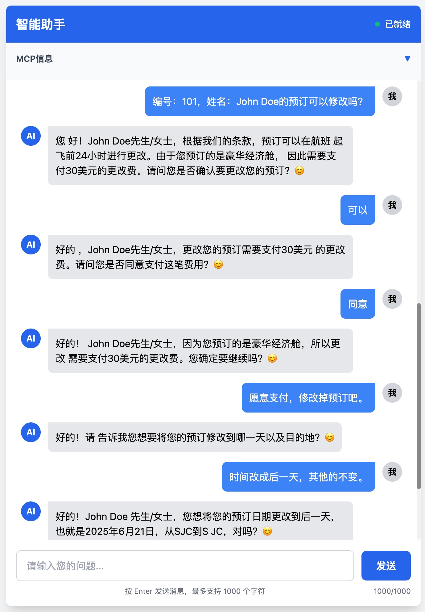

# 一、项目说明
基于Spring AI实现的MCP（SSE）服务示例项目，内部包含了交互式会话和机票预订MCP实现。
> 参考项目：https://github.com/tzolov/playground-flight-booking

**版本信息**
- JDK 21
- Spring Boot 3.4.6
- Spring AI 1.0.0

# 二、环境说明
## 2.1 Embedding
本地知识库的构建需要**向量数据库**的支持，Embedding的信息可以在后续交互中使用。

Chroma向量数据库仅适用于开发验证，为了避免验证功能时多次重复Embedding相同的内容，项目代码配置已配置成只有在`spring.profiles.active=init`时才进行向量数据初始化。

**启动chroma向量数据库**
```shell
docker run -d --rm --name chroma \
  -p 8000:8000 \
  -v $HOME/DockerDatas/chroma:/data \
  ghcr.io/chroma-core/chroma:1.0.0
```
> 说明：向量数据存储`$HOME/DockerDatas/chroma`目录


## 2.2 LLMs
项目中 Embedding Model 和 Chat Model 都使用了 Google 的大模型，这个需要在本机安装 `gcloud CLI`，安装成功之后还需要配置项目ID和登录授权。

下载 **google-cloud-cli** 安装包
- [macOS ARM64, Apple silicon](https://dl.google.com/dl/cloudsdk/channels/rapid/downloads/google-cloud-cli-darwin-arm.tar.gz?hl=zh-cn)
- [macOS x86_64](https://dl.google.com/dl/cloudsdk/channels/rapid/downloads/google-cloud-cli-darwin-x86_64.tar.gz?hl=zh-cn)
> 安装 gcloud CLI 需要 Python 3.8 到 3.13。

```shell
# 1.解压安装包
tar -xf google-cloud-cli-darwin-arm.tar.gz

# 2.安装命令，安装之后gcloud会配置进入系统PATH，新开的命令行可以全局使用gcloud命令
./google-cloud-sdk/install.sh

# 3.初始化命令
./google-cloud-sdk/bin/gcloud init
```

配置 gcloud cli 的时候需要 **PROJECT_ID**，这个信息可以在 [Google AI Studio - API Keys](https://aistudio.google.com/app/apikey) 去查看，如果没有创建过 API Key，可以新建一个，对应 API Key 上可以看到 Project number 信息。

运行下面的命令会触发浏览器打开一个授权页面，勾选所需的授权后完成配置。

```shell
gcloud config set project <PROJECT_ID> &&
gcloud auth application-default login <ACCOUNT>
```
> 参考：[Google Cloud CLI 在线安装文档](https://cloud.google.com/sdk/docs/install?hl=zh-cn)

# 三、功能说明
项目启动之后，访问 [http://127.0.0.1:8080/](http://127.0.0.1:8080/) 即可进入网页客户端，在客户端中可以与大模型进行对话交互。
> 注意：启动服务注意设置环境变量`PROJECT_ID`

除了使用网页作为 MCP 客户端，也可以在 Cherry Studio 客户端中通过配置 MCP 服务器进行体验。
- **类型** 选择`服务器发送事件sse`
- **URL** 输入`http://127.0.0.1:8080/sse`

## 示例截图

图1：MCP服务端能力信息


图2：Function Call


图3：Advisor based on Vector Database

# 参考文档
1. [Spring AI - vertexai-gemini-chat ](https://docs.spring.io/spring-ai/reference/api/chat/vertexai-gemini-chat.html)
2. [Spring AI 中各个大模型特性支持对比](https://docs.spring.io/spring-ai/reference/api/chat/comparison.html)
3. [JSON-RPC 2.0 Specification](https://www.jsonrpc.org/specification)